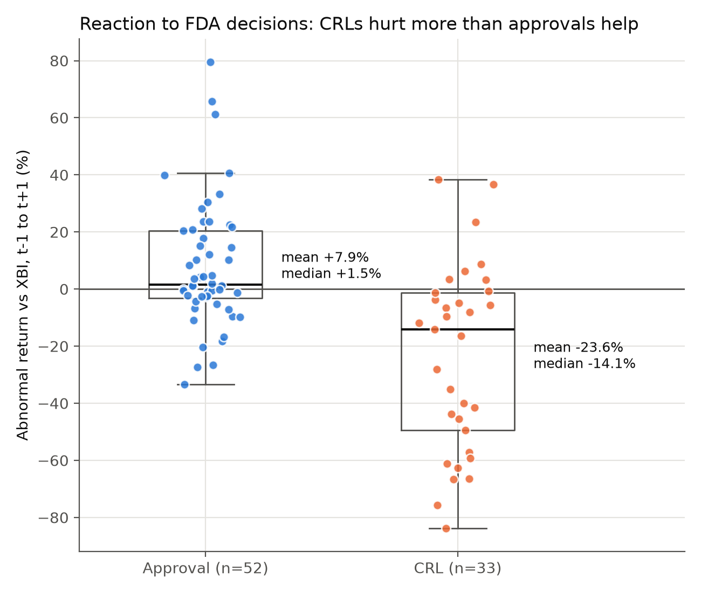
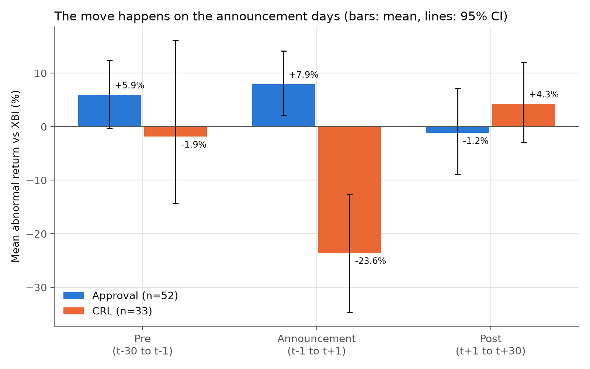
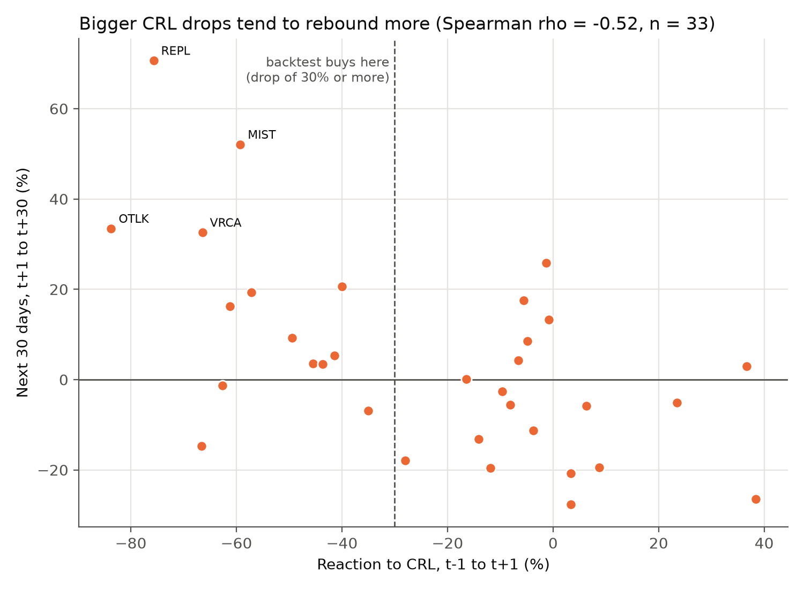
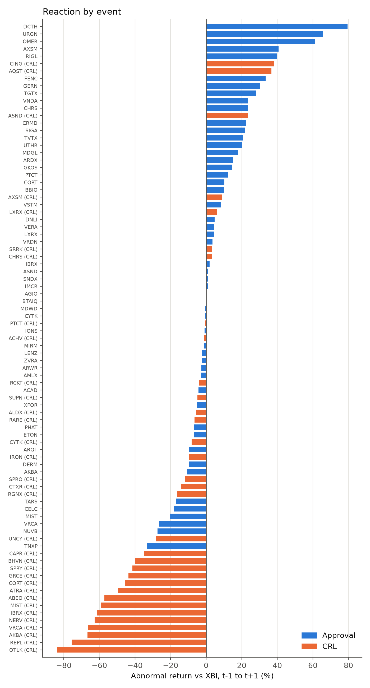

# How Do Biotech Stocks React to FDA Decisions?

This project looks at how small and mid cap US biotech stocks move when the FDA approves a drug or sends a Complete Response Letter (CRL), which basically means the drug was not approved. The sample covers 2022 to 2026.

Main result: over the two trading days around the announcement, compared with the biotech sector ETF (XBI),

- stocks went up 7.9% on average after an approval (52 events, p = 0.013)
- stocks went down 23.6% on average after a CRL (33 events, p = 0.0002)

So the market reacts about 3 times more strongly to bad news than to good news. I checked this in several ways (SPY as the benchmark, a market model, removing events with other news on the same day, a different reaction day rule) and it holds in all of them.



## Why I did this

A lot of small biotech companies depend on one drug, so a single FDA decision can decide whether the company survives. I wanted to find out:

1. How big is the average reaction to an approval and to a CRL?
2. Is it symmetric, or does bad news matter more?
3. Does the stock move before the news comes out, and does it keep moving (or bounce back) afterwards?

## Data

I ended up with 93 FDA decisions between January 2022 and September 2026, all checked by hand. 85 of them have price data (52 approvals and 33 CRLs).

Rules for the sample:

- US listed companies with market cap under $10B the day before the event
- one event per company per decision type (the first one), so one company can't dominate the results
- all application types are included (new drugs, new formulations, biologics, gene and cell therapies), and each event is tagged so I can test subsets separately

Where the events come from:

| Source | Used for |
|---|---|
| openFDA drugsfda | approvals (NDA and BLA, original approvals only) |
| openFDA CRL database | CRLs from 2024 onwards |
| SEC EDGAR full text search of 8-K filings | CRLs from 2022 and 2023 |

One thing I learned the hard way: the FDA's CRL database before 2024 mostly contains drugs that were approved later. If I had used it for 2022 and 2023, I would only have seen CRLs that had a happy ending (look ahead bias). So for those years I searched the 8-K filings that companies published at the time instead.

How I checked the data:

- Reaction day. The FDA decision date is often not the day the stock actually reacts. I looked up the press release time for each event, and anything released after 4pm ET counts for the next trading day.
- Automatic checks. `data_build/verify_events.py` compares every event with SEC filing times, recalculates market cap, tags each drug using openFDA, and flags other filings that could move the price on the same days. This found a few reaction dates that I had entered wrong.
- Other news on the same day. 11 events had earnings, a stock offering or a financing deal at the same time. I kept them in the sample but also ran the results without them.
- Excluded events are kept in `data/events_excluded.csv` with the reason (for example a company that was too large, or one mainly listed outside the US).

## Method

Abnormal return = stock return minus XBI return over the same days. I also did it with SPY to check.

Windows, counted in trading days around the reaction day t (close to close):

| Window | Days | Question |
|---|---|---|
| Pre | t-30 to t-1 | Did the stock move before the news? |
| Announcement | t-1 to t+1 | The reaction itself (main result) |
| Post | t+1 to t+30 | Does the move continue or reverse? |

I used two days for the announcement window so that if my reaction day is off by one day, the reaction is still inside the window.

Because the sample is small and a few stocks move a lot, I don't rely only on the t test. Every result also has a Wilcoxon signed rank test and a bootstrap 95% confidence interval. To compare approvals with CRLs I used Welch's t test and the Mann Whitney U test.

## Results

### Main result

| | n | Mean | Median | t test p | Wilcoxon p | 95% CI (bootstrap) |
|---|---|---|---|---|---|---|
| Approval | 52 | +7.94% | +1.53% | 0.013 | 0.040 | [+2.1, +14.0] |
| CRL | 33 | -23.60% | -14.12% | 0.0002 | 0.0002 | [-34.6, -12.9] |

The difference is 31.5 percentage points (Welch p < 0.001, Mann Whitney p < 0.001), and the CRL reaction is 3.0 times the approval reaction.

The median for approvals (+1.5%) is a lot lower than the mean. My reading is that most approvals are already expected and don't move the stock much, while a few surprises move it a lot.

### Robustness checks

| Check | Approval | CRL |
|---|---|---|
| Main (vs XBI) | +7.9% (p = 0.013) | -23.6% (p = 0.0002) |
| vs SPY instead | +7.9% (p = 0.015) | -23.5% (p = 0.0003) |
| Market model with BMP test | +7.4% (p = 0.006) | -24.5% (p = 0.0007) |
| Without events that had other news | +8.7% (p = 0.019) | -25.1% (p = 0.0002) |
| Drop the largest and smallest event | +7.3% (p = 0.011) | -23.7% (p = 0.0001) |
| New drugs only | +5.7% (p = 0.054) | -24.7% (p = 0.001) |
| Reaction day = FDA date for all approvals | +6.6% (p = 0.030) | |

Market model (`3_market_model.py`): subtracting XBI assumes every stock has a beta of 1. To check this, I estimated alpha and beta for each stock with OLS using days t-250 to t-31, and then scaled each abnormal return by its prediction error variance (which includes the error from estimating alpha and beta). I used the BMP test (Boehmer, Musumeci and Poulsen, 1991) as the main test here, because volatility on FDA days is much higher than on normal days. The median beta came out around 1.0, and the ranking of events is almost the same as with the simple method (Spearman rho = 0.996).

Reaction day (`4_anchor_check.py`): I redid every approval using one simple rule (reaction day = FDA date) and got a similar result. The two versions have a rank correlation of 0.97 and no systematic difference (Wilcoxon p = 0.21).

The weakest result is approvals of new drugs only, which is borderline (p around 0.05). The CRL result is strong in every version.



### Before and after the announcement

- Before: nothing significant before CRLs (-1.9%, p = 0.82). Before approvals there is a small run up (+6.0%, p = 0.07), which might mean some of it was expected, but it is not significant.
- After: on average there is no significant drift for either type. But for CRLs, the bigger the drop, the bigger the bounce over the next 30 days (Spearman rho = -0.52, p = 0.002). It looks like the market overreacts to the worst CRLs.
- Some other comparisons that were not significant: approval reactions were bigger in 2022 and 2023 (+13.0%) than in 2024 to 2026 (+4.0%), p = 0.15. CRLs for gene and cell therapies (reviewed by CBER) fell more (-34.9%, 7 events) than other CRLs (-20.6%). Small caps fell more than mid caps after a CRL (-27.0% vs -13.1%, p = 0.26).

## Backtest: buying after big CRL drops



Since big CRL drops seemed to bounce back, I tested whether you could actually trade on it.

Rule: if the stock falls 30% or more vs XBI from t-1 to t+1, buy at the close on t+1 and sell at the close on t+30, and short the same amount of XBI as a hedge. I assumed 1% trading costs for the round trip. The rule only uses information you would have at the time.

Result: 14 trades, average +16.4% per trade, median +11.7%, 11 out of 14 made money (t test p = 0.021, Wilcoxon p = 0.013). Changing the costs (0.5% to 2%) or the threshold (20% or 40%) barely changes this. CRLs that fell less than 30% actually kept falling afterwards (average -6.4%, 19 events).

Then I tried to break it:

- Out of sample test. I picked the threshold using only 2022 to 2024 (it chose 20%) and applied it to 2025 and 2026 without changing anything. It made +15.8% per trade, so same direction, but with only 8 trades it is not significant (p = 0.18).
- Survivorship bias. 7 companies that got CRLs have no price data because they were acquired or delisted later. If I assume all of them were trades that lost 100%, the average becomes -22.7%. At -50% it is -6.1%. This is an extreme assumption since those stocks were still trading during the 30 days and not all of them would have triggered the rule, but it shows the result depends a lot on the missing companies.
- Placebo. I looked at the same stocks when they crashed 30% or more without a CRL. They bounced back +4.7% on average (52 cases, not significant). The CRL bounce is bigger, but the difference is not significant (Mann Whitney p = 0.11).
- Without the XBI hedge the average is +14.5%, but the worst trade is -43.5% (p = 0.095). So the hedge mostly reduces risk.

My conclusion: the bounce after big CRL drops is large in this sample, but with so few trades, a weak out of sample test, survivorship bias and the placebo result, I don't think I can say this is a real tradable strategy or something special about CRLs.

## Limitations

- The samples are small (52 and 33 events, 14 trades in the backtest). I also ran a lot of subgroup tests, so a single p < 0.05 in one subgroup shouldn't be taken too seriously.
- Survivorship bias. Companies that were acquired or delisted have no price history on yfinance (7 events in my sample plus 6 other CRLs, all listed in `data/survivorship.csv`). Companies are more likely to disappear after the worst outcomes, so the real CRL reaction could be even bigger than what I found.
- Some decisions were made by hand: reaction days, whether an unapproved drug counts as a new drug, and which events had other news. I wrote down the reasons in the data and in `data_build/`.
- About 30 approvals were added with a simpler rule (reaction day = FDA date). `4_anchor_check.py` shows this doesn't change the result.
- This is not a new finding. Other event studies have already shown that biotech stocks react strongly to FDA news. What I added is a recent sample (2022 to 2026), CRLs collected from 8-K filings to avoid look ahead bias, automatic checks of the data, and the robustness tests.

## What I would do next

- Find prices for the acquired and delisted companies from another data source, to fix the survivorship problem.
- Go back to 2015 to 2021 so I can do a proper out of sample test.
- Look at other events with bigger samples, like Phase 3 trial results or FDA advisory committee votes.

## Files

```
1_event_returns.py          abnormal returns for each event (pre, announcement, post)
2_significance_tests.py     t test, Wilcoxon, bootstrap CI, subgroups
3_market_model.py           OLS market model, Patell and BMP tests
4_anchor_check.py           checks if the reaction day rule changes the result
5_backtest_crl_rebound.py   CRL bounce backtest with out of sample, survivorship and placebo checks
6_make_charts.py            makes the charts
data/                       events_verified.csv (final sample), events_excluded.csv, survivorship.csv
results/                    output of all scripts
charts/                     charts used in this README
data_build/                 scripts I used to collect and check the data (not needed to rerun the results)
```

Each script has a short explanation at the top of what it does and why.

## How to run

```bash
pip install -r requirements.txt
python3 1_event_returns.py
python3 2_significance_tests.py
python3 3_market_model.py
python3 4_anchor_check.py
python3 5_backtest_crl_rebound.py
python3 6_make_charts.py
```

Prices are downloaded from yfinance, so the first run takes a few minutes. The numbers might change slightly if Yahoo updates its historical data.

<details>
<summary>All events sorted by reaction</summary>



</details>
